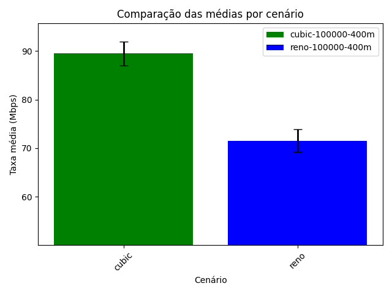
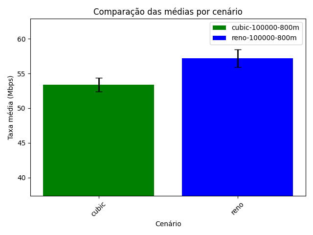
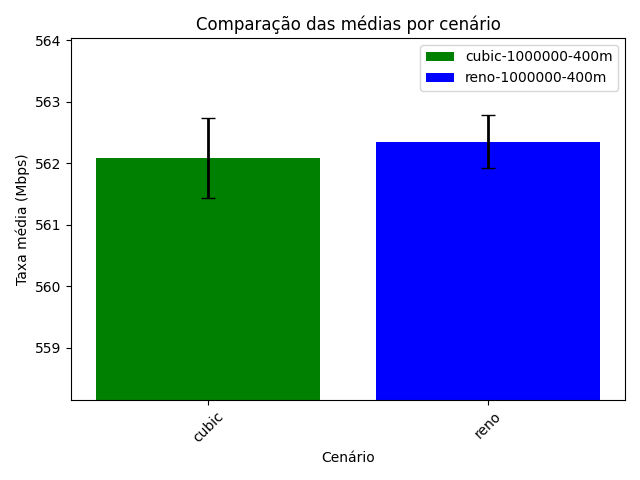
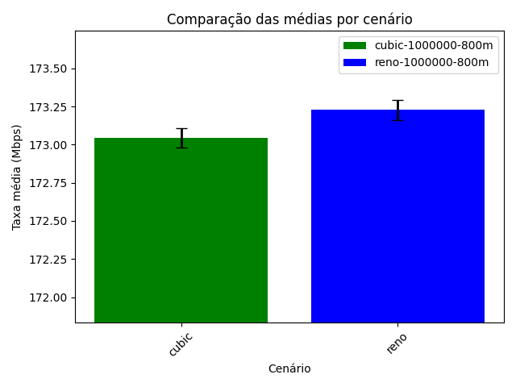

# Instruções de Uso

Este é um projeto Python que lida com experimentos utilizando a ferramenta Imunes para criar cenários de rede. Os resultados dos experimentos são escritos em arquivos no diretório `./resultados/` e os arquivos com os gráficos no diretório `./graficos/`.

## Pré-requisitos

Antes de executar este código, certifique-se de que você tenha instalado no SO:

- Python 3.10.
- [Imunes](https://github.com/imunes/imunes)
- Usuário com acesso *root*

## Como Usar

1. **Criando ambiente virtual e instalar dependências**

   Execute comando a seguir:
      
   ```bash
   python3 -m venv venv
   source venv/bin/activate
   pip3 install -r requirements.txt
   ```

2. **Executando experimento com Cenário Padrão**

   <!-- É possível criar outro cenário pela interface do Imunes e atualizar o código presente no arquivo `gerar_dados.py` para o funcionamento correto. Atualmente, o experimento só funciona com o cenário padrão ("ads-cenario.imn"). -->

   Execute comando a seguir no terminal dentro da raiz do projeto (será solicitado a senha do usuário):
      
   ```bash
   python3 manager.py
   ```

3. **Executando análise dos dados**
   ```bash
   python3 analisar_dados.py <arquivo.csv>
   ```
   
4. **Visualização de logs**


   A execução do *script* pode ser acompanhada através dos *logs* que são gerados também no arquivo `logs/log.txt`. Execute o seguinte comando em outro terminal no mesmo diretório desse projeto:

   ```bash
   tail -f -n 10 logs/log.txt
   ```


# Cenário

No modo *default* experimento avalia o comportamento de dois algoritmos de controle de congestionamento (cubic e reno) em uma topologia contendo 4 **hosts** e dois **roteadores**:

``` python
pc1 = Node(f"pc1", {"eth0":"10.0.1.20"})
pc2 = Node(f"pc2", {"eth0":"10.0.2.20"})
pc3 = Node(f"pc3", {"eth0":"10.0.3.20"})
pc4 = Node(f"pc4", {"eth0":"10.0.4.20"})

router1 = Node("router1", {"eth0":f"10.0.0.1", "eth1":f"10.0.1.1", "eth2":f"10.0.3.1"})
router2 = Node("router2", {"eth0":f"10.0.0.2", "eth1":f"10.0.2.1"," eth2":f"10.0.4.1"})

```

Os links são ethernet 1Gbps, e no link entre roteadores com BER 1/1000000 e BER 1/100000.

### Algoritmo Cubic

Ele faz o controle do congestionamento do TCP (Transmission Control Protocol) em redes de alta velocidade. Foi desenvolvido como uma alternativa ao algoritmo Reno, que às vezes não era eficaz em lidar com as altas taxas de transferência de dados em redes modernas.

#### Principais características do Cubic:

* Utiliza uma abordagem baseada em janelas deslizantes para controlar o congestionamento;
* Calcula a taxa de transferência ideal com base em uma função cúbica e ajusta a janela de congestionamento de acordo;
* É mais agressivo em termos de aumento da taxa de transferência após um período de perda de pacotes e, em seguida, diminui a taxa de crescimento de forma mais suave;
* É eficaz em redes de alta velocidade, pois é capaz de explorar largura de banda disponível rapidamente.

### Algoritmo Reno

É um dos algoritmos mais antigos e amplamente usados de controle de congestionamento para o TCP. Ele foi projetado para ser um algoritmo conservador e está presente na maioria das implementações do TCP em sistemas operacionais.

#### Principais características do Reno:

* Utiliza uma abordagem baseada em janelas deslizantes e um sistema de aumento linear e diminuição exponencial de sua janela de congestionamento;
* Quando ocorre uma perda de pacotes, o Reno reduz drasticamente sua taxa de transferência, o que o torna sensível a eventos de perda de pacotes;
* É amplamente adotado e funciona bem em uma variedade de cenários de rede, mas pode não ser tão eficaz em redes de alta velocidade.

Em resumo, Cubic e Reno são dois algoritmos de controle de congestionamento usados no TCP, cada um com suas próprias características. O Cubic é mais agressivo em redes de alta velocidade, enquanto o Reno é mais conservador e amplamente adotado em redes convencionais. A escolha entre eles depende do contexto e dos requisitos de desempenho da rede. Este experimento visa realziar uma comparação de desempenho entre os dois algoritmos, em um cenário automatizado.


A parametrização dos algoritmos esta sendo definida da seguinte forma:

```python
# Fatores
fatores = {}
fatores['alg'] = ['cubic', 'reno']
fatores['ber'] = ['100000', '1000000']
fatores['bg'] = ['400m', '800m']
```

O exeprimento deve iterar sobre todas as combinações possíveis dos fatores `alg`, `ber` e `bg`. Para cada combinação, ele executará o experimento realizando a comunicação combinando as 6 variações de `fatores` definidas, onde respectivamente representam os algoritmos comparados, a taxa de erro de *bit* e a taxa de transferência em *background* (em bits por segundo) durante um teste de largura de banda.

Para cada exeprimento:

> * Tempo de tx para cada repetição = 2 min;
> * Número de repetições = 8.


Para analisar os resultado são gerados 2 arquivos CSV com os resultados de cada experimento, cada arquivo contento os dados do servidor e do cliente envolvidos na comunicação. A estrutura do arquivo CSV esta definda abaixo: 

``` python 
column_names = ['tag','timestamp','ip_fonte','porta_fonte', 'ip_destino', 'porta_destino', 'protocolo', 'intervalo_medicao', 'id_tx', 'tx_bps']

```

# Conclusões
Baseado nestes arquivos, gráficos comparativos são gerados para **Análise de Desempenho** de cada experimento, comparando as médias de cada cenário, sendo eles combinados em **(BER-bg)**.

### Cenário com BER =  100000 e Taxa de Transferência em Background [bg] = 400M



Na Figura acima, no cenário de menor BER e menor [bg] o `cubic` teve um desempenho muito superior ao reno.  

### Cenário com BER =  100000 e [bg] = 800M


Ja neste cenário aumentando a Taxa de Transferência Máxima, o `cubic` cai significativamente de desempenho, sendo até mesmo superado pelo `reno`, que por sua vez, teve pouca queda no desempenho.

### Cenário com BER =  1000000 e [bg] = 400M


Agora diminuindo o BER para 1/1000000 a taxa média de transferência em geral aumenta significativamente. E neste cenário, os algoritmos possuem desempenho muito semelhante.

### Cenário com BER =  1000000 e [bg] = 800M



O último cenário do experimento avança com o aumento da Taxa de Transferência Máxima, a Taxa média de transferência reduz. A diferença de desempenho entre os algoritmos segue semelhante, ainda tendo superioridade do `reno`.