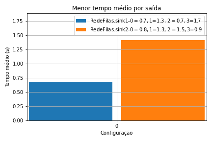

# Tarefa A3.2 - Simulação de Rede de Filas com Omnet

Este diretório contém um projeto OMNeT++ com a implementação de uma simulação de redes de filas MM1.

## Pré-requisitos

Antes de executar este projeto, certifique-se de que você tenha instalado no SO:

- [OMNeT++ 6.0](https://doc.omnetpp.org/omnetpp/InstallGuide.pdf)

## Como Usar

1. Faça clone do repositório com comando a seguir:
      
   ```bash
   git clone https://github.com/Faracoeng/ADS.git
   ```
2. Acesse a IDE do OMNeT++ e crie um novo projeto vazio (File >> New >> OMNeT++ Project);
3. Copie os arquivos do subdiretório [Rede_Filas_Omnet](./) para o diretório do projeto recém criado;
4. Execute a simulação (Run As >> OMNeT++ Simulation) selecionando um dos arquivos de configuração (`.ini`);

Mais informações acesse [OMNeT++ Technical Articles](https://docs.omnetpp.org/)

# Cenário

## Modelo 

O modelo de rede de filas MM1 simulado está ilustrado na figura a seguir:


## Fatores

Os fatores e níveis utilizados estão descritos nas tabelas abaixo e foram configurados no arquivo [redes.ini](./redes.ini).

* Geração de requisições
  
    | Módulo  | carga 1 - 1\/[req\/s]| carga 2 - 1\/[req\/s]  |
    |:---:|:---:|:---:|
    |gen0   | 0.7  | 0.8  |  
    |gen1   | 0.9  | 1.3  | 
    |gen2   | 0.7  | 1.5  | 
    |gen3   | 0.9  | 1.7  | 

* Tempo de serviço
  
    | Módulo  | Tempo médio de serviço - 1\/[req\/s]|
    |:---:|:---:|
    |queue0   | 0.1s  | 
    |queue1   | 0.3s  | 
    |queue2   | 0.5s  |
    |queue3   | 0.2s  | 


# Análise dos resultados

1. Apresente um gráfico de barras mostrando o tempo médio para cada saída. Qual a configuração que produziu o maior tempo médio de permanência no sistema em cada saída? Qual a possível explicação?
   
    Na figura a seguir é apresentado um gráfico de barras ilustrando o tempo médio de permanência no sistema em cada saída considerando todas as configurações possíveis de fatores.
   
    

    As configurações que tiveram o maior tempo médio de permanência no sistema em cada uma das duas saídas é apresentado no gráfico da figura a seguir.

    

2. Apresente um gráfico de linha mostrando o tempo de estadia no sistema
para cada requisição, para o cenário de maior tempo médio observado no
item anterior.

    O gráfico de linha apresentado na figura seguinte ilustra o tempo de estadia no sistema levando-se em consideração as duas configurações com maior tempo médio.
    
    

3. Estude como poderia apresentar o tamanho da fila em cada subsistema na
forma de um histograma. Apresente um histograma para cada fila para o melhor cenário apresentado no item 1.

    Para armazenar a estatística sobre o tamanho da fila (*buffer*) em cada subsistema foi utilizado o mecanismo de *signals* do OMNeT++. Para isso, no código fonte do módulo `Queue` ([queue.cc](./queue.cc)) foi criado a variável `simsignal_t queueSizeSignal` e no método `handleMessage` foi adicionado as chamadas para emitir o sinal com o tamanho da fila:
    
    ```c++
    emit(queueSizeSignal, buffer.getLength());
    ```

    No arquivo [redes.ned](./redes.ned) foi preciso configurar esse parâmetro para armazenar os valores durante a simulação.

    ```
    @signal[queueSizeSignal](type="int");
    @statistic[queueSize](title="Buffer Size"; source="queueSizeSignal"; record=vector,stats; interpolationmode=none);
    ```

    Na figura seguinte é apresentado um grafico de barras com as duas configurações que tiveram menor tempo médio de permanência no sistema.

    

    Considerando a configuração da saída `sink1` como melhor cenário, foi gerado o histograma, apresentado na figura a seguir, com o tamanho do *buffer* em cada fila (subsistema).

    

    
